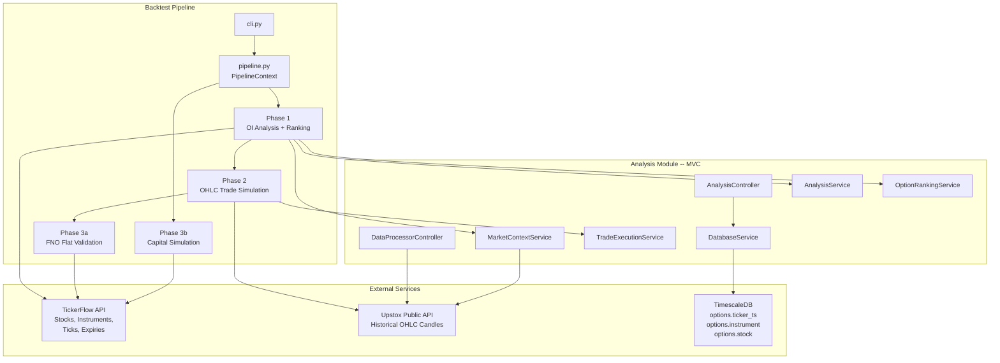
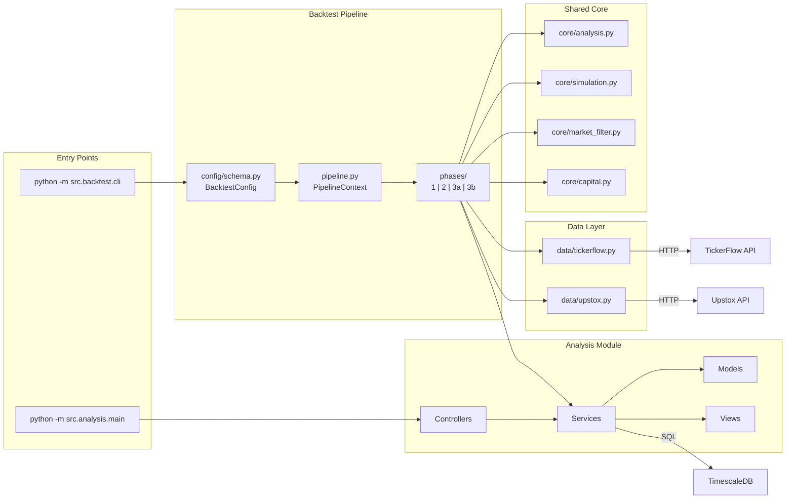
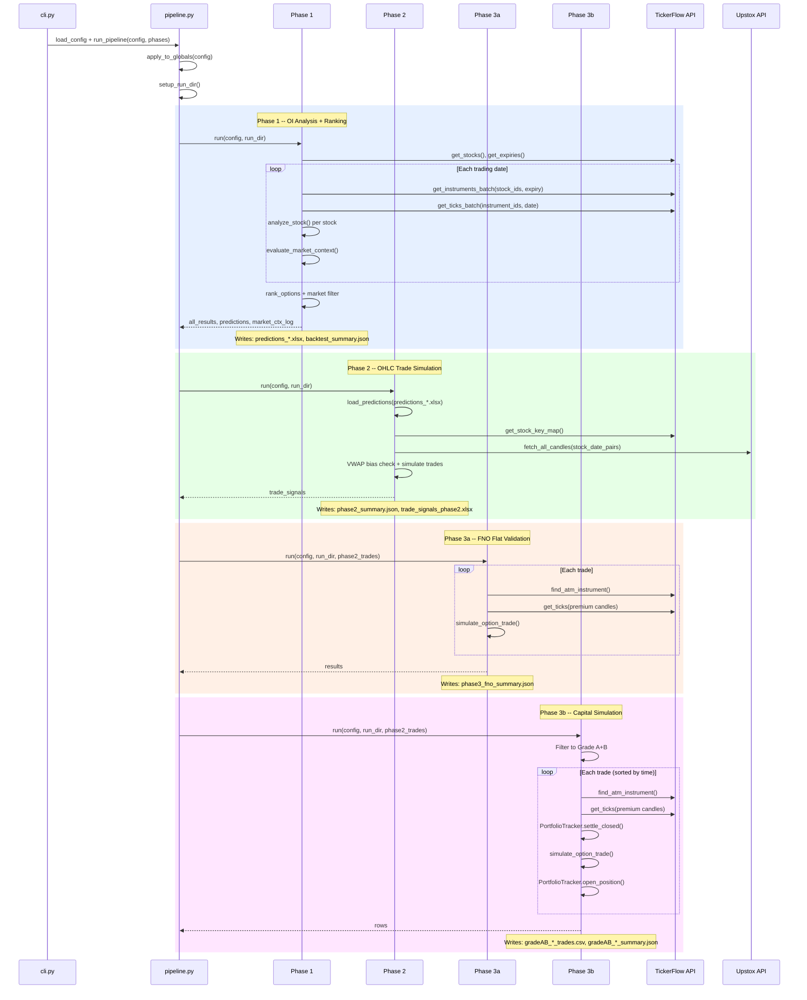

# StockX Analysis & Backtest

---

## Table of Contents

1. [Project Overview](#1-project-overview)
2. [System Architecture](#2-system-architecture)
3. [Codebase Structure](#3-codebase-structure)
4. [Core Workflows](#4-core-workflows)
5. [Key Design Patterns](#5-key-design-patterns)
6. [Important Classes and Modules](#6-important-classes-and-modules)
7. [Configuration and Environment](#7-configuration-and-environment)
8. [Local Development Setup](#8-local-development-setup)
9. [Deployment and Infrastructure](#9-deployment-and-infrastructure)
10. [Observability](#10-observability)
11. [Security Considerations](#11-security-considerations)
12. [Common Failure Points](#12-common-failure-points)
13. [Future Improvements](#13-future-improvements)

---

## 1. Project Overview

### Purpose

STOCKX is an **options trading signal analysis and multi-phase backtesting system** for the Indian equity derivatives market (NSE F&O). It processes Open Interest (OI) tick data to identify bullish/bearish signals, grades them by strength, validates them against market context, and then simulates their real-world profitability across multiple dimensions.

### Problem It Solves

Before deploying real capital on OI-based trading strategies, you need answers to:

- **Do the OI signals actually predict direction?** (Phase 1 -- analysis and ranking)
- **Do the signals translate to profitable stock trades?** (Phase 2 -- OHLC simulation with VWAP bias, R:R targets)
- **Do the signals work on actual option premiums?** (Phase 3a -- F&O flat validation)
- **How much money do I make with a real account?** (Phase 3b -- compounding capital simulation with concurrent position tracking)

This system answers all four questions with historical data, producing detailed trade logs, PnL breakdowns, and win-rate statistics.

### High-Level Architecture



### Key Technologies

| Technology | Version | Purpose |
|------------|---------|---------|
| Python | 3.12+ | Runtime |
| pandas | >= 2.0 | Data processing and time-series manipulation |
| httpx | >= 0.24 | Synchronous HTTP client (TickerFlow API) |
| aiohttp | >= 3.9 | Async HTTP client (Upstox candle fetching) |
| SQLAlchemy | >= 2.0 | ORM and database connection management |
| psycopg2 | >= 2.9 | PostgreSQL driver |
| TimescaleDB | -- | Time-series database (tick data storage) |
| openpyxl | >= 3.1 | Excel file I/O for predictions and trade signals |
| python-dotenv | >= 1.0 | Environment variable management |

---

## 2. System Architecture

### Component Diagram



### External Dependencies

| Service | Protocol | Authentication | Usage |
|---------|----------|---------------|-------|
| **TickerFlow API** | HTTPS | `X-API-KEY` header | Stocks, instruments, expiry dates, OI tick data, ATM instrument lookup |
| **Upstox Public API** | HTTPS | None (public endpoint) | Historical 1-minute OHLC candles for equity and index instruments |
| **TimescaleDB (PostgreSQL)** | TCP/SQL | User/password via `DATABASE_URL` | Direct access to `options.ticker_ts`, `options.instrument`, `options.stock` tables (analysis module only) |

### Deployment Model

Currently a single-machine Python application with no containerization. Runs as CLI commands in a virtual environment. Results are stored on local disk. See [Section 9](#9-deployment-and-infrastructure) for details.

---

## 3. Codebase Structure

```
stockx-ab/
├── .env                          # Environment variables (gitignored)
├── .gitignore
├── db_config.py                  # DATABASE_URL builder from env vars
├── requirements.txt              # Python dependencies
├── README.md                     # This document
├── plan.md                       # Documentation generation prompt
│
├── src/
│   ├── __init__.py
│   │
│   ├── analysis/                 # OI Analysis Module (MVC)
│   │   ├── main.py               # CLI: --mode full|analysis|processing|get-key
│   │   ├── config/
│   │   │   └── settings.py       # Runtime config singletons (dataclasses)
│   │   ├── controllers/
│   │   │   ├── analysis_controller.py      # Analysis workflow orchestrator
│   │   │   └── data_processor_controller.py # Post-analysis OHLC + trade evaluation
│   │   ├── models/
│   │   │   └── entities.py       # Domain entities: Stock, StockPrediction, TradeSignal, etc.
│   │   ├── services/
│   │   │   ├── analysis_service.py         # OI classification, trend/grade, ranking
│   │   │   ├── database_service.py         # TimescaleDB access layer
│   │   │   ├── external_api_service.py     # Upstox candles + instrument key mapping
│   │   │   ├── market_context_service.py   # Index trend (VWAP/SMA) evaluation
│   │   │   └── trade_service.py            # Trade signal building + simulation
│   │   └── views/
│   │       └── export_view.py    # Excel, CSV, Pickle export + FileManager
│   │
│   ├── backtest/                 # Backtest Pipeline
│   │   ├── __init__.py
│   │   ├── __main__.py           # Enables: python -m src.backtest
│   │   ├── cli.py                # Unified CLI entry point (argparse)
│   │   ├── pipeline.py           # PipelineContext + run_pipeline orchestrator
│   │   ├── config/
│   │   │   ├── schema.py         # BacktestConfig dataclass + load_config + apply_to_globals
│   │   │   └── presets/
│   │   │       ├── full_2025.json    # 220 trading days (Feb--Dec 2025)
│   │   │       ├── q1_2026.json      # 46 trading days (Jan--Mar 2026)
│   │   │       └── single_day.json   # Template for quick single-date tests
│   │   ├── core/
│   │   │   ├── analysis.py       # pick_expiry, analyze_stock, get_trading_timestamps
│   │   │   ├── simulation.py     # simulate_option_trade, staged entry, RSI computation
│   │   │   ├── market_filter.py  # Market context tagging, signal cutoff filter
│   │   │   └── capital.py        # PortfolioTracker, compute_lot_count
│   │   ├── data/
│   │   │   ├── tickerflow.py     # TickerFlow API client (httpx, retry, IST normalization)
│   │   │   └── upstox.py         # Upstox OHLC fetcher, 1m-to-5m resampler
│   │   ├── phases/
│   │   │   ├── phase1_analysis.py    # OI analysis + ranking + market context
│   │   │   ├── phase2_trades.py      # OHLC trade simulation (VWAP bias, R:R)
│   │   │   ├── phase3_fno.py         # FNO flat per-trade validation (all grades, 1L/trade)
│   │   │   └── phase3_capital.py     # Grade A+B compounding capital simulation
│   │   └── results/              # Timestamped run outputs (gitignored)
│   │
│   └── setup/
│       └── setup_jump_server.sh  # Data collection VM provisioning (cgr-trades project)
```

### Module Responsibilities

| Module | Responsibility |
|--------|---------------|
| `src/analysis/` | Full MVC analysis pipeline: DB-driven OI analysis, ranking, market context, trade evaluation, export |
| `src/backtest/cli.py` | Single CLI entry point with `--config`, `--phase`, `--date`, `--results-dir` |
| `src/backtest/pipeline.py` | Orchestrates phases, manages `PipelineContext` for in-memory data passing |
| `src/backtest/config/` | `BacktestConfig` dataclass and JSON presets for reproducible runs |
| `src/backtest/core/` | Shared logic extracted from old scripts: analysis helpers, trade simulation, market filtering, capital tracking |
| `src/backtest/data/` | External data access: TickerFlow API client and Upstox candle fetcher |
| `src/backtest/phases/` | Phase implementations (1, 2, 3a, 3b) -- each is a standalone module that can run independently or as part of the pipeline |

### Entry Points

| Command | Purpose |
|---------|---------|
| `python -m src.backtest.cli --config full_2025.json` | Run backtest pipeline (all phases) |
| `python -m src.backtest.cli --config full_2025.json --phase 2` | Run a single phase |
| `python -m src.backtest.cli --config full_2025.json --date 2025-02-28` | Single-date quick test |
| `python -m src.analysis.main --mode full` | Run analysis module (DB-connected) |
| `python -m src.analysis.main --mode get-key --stock-name RELIANCE` | Look up instrument key |

---

## 4. Core Workflows

### Backtest Pipeline Flow



### Phase Summary

| Phase | Input | External Calls | Output | Question Answered |
|-------|-------|----------------|--------|-------------------|
| **Phase 1** | Config (trading dates, strategy params) | TickerFlow: stocks, instruments, ticks | `predictions_*.xlsx`, `backtest_summary.json` | Do OI signals predict direction? |
| **Phase 2** | Phase 1 Excel | Upstox: OHLC candles | `phase2_summary.json`, trade signals Excel | Do signals translate to profitable stock trades? |
| **Phase 3a** | Phase 2 trades | TickerFlow: ATM instruments + premium ticks | `phase3_fno_summary.json` | Do signals work on option premiums? |
| **Phase 3b** | Phase 2 trades (Grade A+B only) | TickerFlow: ATM instruments + premium ticks | CSV trade log + JSON summary | How much money with a real account? |

### Data Handoff Between Phases

When running all phases together (`--phase all`), data flows through `PipelineContext` **in-memory**, avoiding file I/O between phases. When running a single phase standalone (e.g., `--phase 3a --results-dir path/to/run`), the phase loads its inputs from the JSON/Excel files written by previous phases.

### Analysis Module Flow (DB-Connected)

The analysis module (`src/analysis/`) is the standalone version that connects directly to TimescaleDB:

```
AnalysisController.run()
  -> DatabaseService.get_stocks()
  -> DatabaseService.get_expiry_dates()
  -> For each trade date:
       -> DatabaseService.get_instruments(stock, expiry)
       -> DatabaseService.get_ticker_data(instruments, date)
       -> AnalysisService.process_ce_pe_pair()
       -> AnalysisService.trend_n_grade_analysis()
  -> OptionRankingService.rank_options()
  -> MarketContextService.filter_predictions()
  -> ExportView.export_predictions_to_excel()
```

The backtest pipeline replicates this flow but substitutes the TickerFlow API for direct DB access, enabling it to run without database connectivity.

---

## 5. Key Design Patterns

### MVC (Analysis Module)

The `src/analysis/` module follows a strict Model-View-Controller pattern:

- **Controllers** (`analysis_controller.py`, `data_processor_controller.py`) -- orchestrate workflows, no business logic
- **Services** (`analysis_service.py`, `trade_service.py`, etc.) -- all business logic lives here
- **Models** (`entities.py`) -- pure dataclasses, no behavior
- **Views** (`export_view.py`) -- output formatting (Excel, CSV, Pickle)

### Pipeline/Chain (Backtest)

The backtest uses a `PipelineContext` dataclass that accumulates outputs as it flows through phases. Each phase function takes `(config, run_dir, **optional_in_memory_data)` and returns its results while also writing them to disk.

### Config-Driven Execution

All backtest parameters live in JSON preset files (`config/presets/*.json`). The `BacktestConfig` dataclass provides defaults, and `load_config()` maps JSON keys to dataclass fields. This eliminates the need for separate scripts per time period.

### Singleton Config Bridge

The analysis module uses mutable global singletons (`strategy_config`, `analysis_config`, `market_context_config`). The backtest's `apply_to_globals()` function mutates these after import to inject backtest-specific parameters. This bridges the config systems without rewriting the analysis services.

### Strategy Pattern

Multiple interchangeable strategies are supported via config:

| Dimension | Options |
|-----------|---------|
| SL method | `vwap`, `percentage`, `candle_low`, `atr` |
| Entry mode | `immediate` (offset N candles), `staged` (RSI/volume confirmation) |
| Market context filter | `block` (drop conflicting), `tag` (annotate only), `downgrade` (lower grade) |
| Index trend method | `vwap` (price vs VWAP), `price_sma` (SMA crossover) |

---

## 6. Important Classes and Modules

### Backtest Pipeline

| Class / Function | File | Responsibility |
|-----------------|------|----------------|
| `BacktestConfig` | `src/backtest/config/schema.py` | Unified configuration dataclass (30+ parameters across all phases) |
| `load_config()` | `src/backtest/config/schema.py` | Load JSON preset into `BacktestConfig`, resolve relative paths |
| `apply_to_globals()` | `src/backtest/config/schema.py` | Mutate analysis module's global config singletons |
| `PipelineContext` | `src/backtest/pipeline.py` | Shared state flowing between phases (results, predictions, trades) |
| `run_pipeline()` | `src/backtest/pipeline.py` | Async orchestrator: runs specified phases, handles data handoff |
| `PortfolioTracker` | `src/backtest/core/capital.py` | Compounding portfolio with concurrent position tracking |
| `compute_lot_count()` | `src/backtest/core/capital.py` | Position sizing under capital constraints |
| `simulate_option_trade()` | `src/backtest/core/simulation.py` | Simulates SL/target/time-exit on premium candles |
| `simulate_staged_entry_trade()` | `src/backtest/core/simulation.py` | RSI+volume confirmation entry before SL/target sim |
| `compute_rsi()` | `src/backtest/core/simulation.py` | EWM-based RSI series computation |
| `pick_expiry()` | `src/backtest/core/analysis.py` | Nearest monthly expiry selection |
| `analyze_stock()` | `src/backtest/core/analysis.py` | Full OI analysis for one stock on one date |

### Analysis Module

| Class | File | Responsibility |
|-------|------|----------------|
| `AnalysisService` | `src/analysis/services/analysis_service.py` | OI action classification (vectorized), trend/grade analysis, OI magnitude weighting |
| `OptionRankingService` | `src/analysis/services/analysis_service.py` | Ranks predictions by TN ratio, filters by grade and consecutive appearance |
| `MarketContextService` | `src/analysis/services/market_context_service.py` | Evaluates index trends (NIFTY 50, NIFTY BANK, etc.) via VWAP or SMA |
| `TradeExecutionService` | `src/analysis/services/trade_service.py` | Builds trade signals with VWAP bias, SL/target calculation, outcome simulation |
| `DatabaseService` | `src/analysis/services/database_service.py` | Async TimescaleDB access: stocks, instruments, ticker data |
| `ExternalAPIService` | `src/analysis/services/external_api_service.py` | Upstox OHLC fetching and instrument key mapping |
| `ExportView` | `src/analysis/views/export_view.py` | Multi-format export (Excel, CSV, Pickle) and `FileManager` utility |
| `AnalysisController` | `src/analysis/controllers/analysis_controller.py` | Orchestrates full analysis workflow |
| `DataProcessorController` | `src/analysis/controllers/data_processor_controller.py` | Post-analysis OHLC fetch + trade evaluation |

### Domain Entities (`src/analysis/models/entities.py`)

| Entity | Purpose |
|--------|---------|
| `Stock` | Active stock with id, name, symbol, instrument_key |
| `Instrument` | Option instrument (CE/PE) with strike, expiry, lot_size, instrument_seq |
| `TickerData` | Single tick from `options.ticker_ts` (OHLCV + OI) |
| `CEPEPair` | Call-Put pair keyed by `instrument_seq` and `strike_price` |
| `StockPrediction` | Analysis output: stock, timestamp, grade, option_type, TN ratio, market trend |
| `PredictionResult` | Container: `call` and `put` lists of date-grouped predictions |
| `TradeSignal` | Fully evaluated trade: entry, SL, target, outcome, PnL |
| `IndexContext` | Market index trend snapshot (trend, confidence, price, SMA values) |
| `OHLCData` | Candle data from Upstox API |
| `AnalysisResultDTO` | Generic result wrapper (success, data, error_message) |
| `ExportResultDTO` | Export result (success, files_created) |

### Grading System

Grades are assigned based on the bullish percentage of OI strikes:

| Grade | Bullish % Range | Meaning |
|-------|----------------|---------|
| A | 100% | Unanimously bullish/bearish across all strikes |
| B | 85--99% | Strong consensus |
| C | 50--84% | Mixed signals |
| D | < 50% | Weak or conflicting |

---

## 7. Configuration and Environment

### Environment Variables

| Variable | Required | Default | Used By |
|----------|----------|---------|---------|
| `TICKERFLOW_URL` | Yes | `http://localhost:8000/api/v1` | `data/tickerflow.py` |
| `TICKERFLOW_API_KEY` | Yes | `""` | `data/tickerflow.py` (X-API-KEY header) |
| `DB_USER` | For analysis module | -- | `db_config.py` |
| `DB_PASSWORD` | For analysis module | -- | `db_config.py` (URL-encoded) |
| `DB_HOST` | For analysis module | -- | `db_config.py` |
| `DB_PORT` | For analysis module | -- | `db_config.py` |
| `DB_NAME` | For analysis module | -- | `db_config.py` |
| `STOCK_SVC_URL` | No | `https://api.example.com/stock` | `db_config.py` |

### Configuration Files

| File | Role |
|------|------|
| `.env` | Environment-specific secrets (gitignored) |
| `db_config.py` | Builds `DATABASE_URL` from env vars for the analysis module |
| `src/analysis/config/settings.py` | Runtime config singletons (7 dataclass configs) |
| `src/backtest/config/schema.py` | `BacktestConfig` dataclass, `load_config()`, `apply_to_globals()` |
| `src/backtest/config/presets/*.json` | Backtest parameter presets (dates, strategy, FNO, capital sim) |

### Runtime Config Singletons (`settings.py`)

| Singleton | Key Parameters |
|-----------|---------------|
| `trading_config` | Market hours (`09:15`--`15:30`), default interval (15 min) |
| `analysis_config` | TN ratio threshold (60), OI weight blend, accepted grades |
| `strategy_config` | R:R ratio, SL method, max holding candles, VWAP bias, max exit time |
| `market_context_config` | Primary index, trend method, filter mode, sector-index mapping |
| `processing_config` | Batch size (50), max concurrent tasks/requests |
| `database_config` | Pool size, table names (`options.ticker_ts`, etc.) |
| `api_config` | Upstox base URL, candle interval |

### Backtest Presets

Presets are JSON files in `config/presets/` that map directly to `BacktestConfig` fields. Missing keys use dataclass defaults.

```bash
# Full 2025 backtest (220 trading days)
python -m src.backtest.cli --config full_2025.json

# Q1 2026 (46 trading days)
python -m src.backtest.cli --config q1_2026.json

# Single day test
python -m src.backtest.cli --config single_day.json --date 2025-03-15
```

---

## 8. Local Development Setup

### Prerequisites

- Python 3.12+
- Access to a TickerFlow API instance (URL + API key)
- (Optional) PostgreSQL/TimescaleDB access for the analysis module

### Step-by-Step

```bash
# 1. Clone
git clone <repo-url> stockx-ab
cd stockx-ab

# 2. Create virtual environment
python -m venv .venv
source .venv/bin/activate

# 3. Install dependencies
pip install -r requirements.txt

# 4. Configure environment
cat > .env << 'EOF'
TICKERFLOW_URL=https://tickerflow.example.com/api/v1
TICKERFLOW_API_KEY=your-api-key-here

# Only needed for src/analysis/ (direct DB mode)
DB_USER=your_user
DB_PASSWORD=your_password
DB_HOST=your_host
DB_PORT=5432
DB_NAME=stock-dumps
EOF
```

### Verify Installation

```bash
# Check CLI loads
python -m src.backtest.cli --help

# Quick smoke test (single date)
python -m src.backtest.cli --config single_day.json --date 2025-02-28
```

### Common CLI Commands

```bash
# Full pipeline (all 4 phases)
python -m src.backtest.cli --config full_2025.json

# Run only Phase 2 (needs Phase 1 results)
python -m src.backtest.cli --config full_2025.json --phase 2

# Run Phase 3a (FNO flat validation)
python -m src.backtest.cli --config full_2025.json --phase 3a

# Run Phase 3b (Grade A+B capital sim)
python -m src.backtest.cli --config full_2025.json --phase 3b

# Resume from existing results directory
python -m src.backtest.cli --config full_2025.json --phase 3a \
  --results-dir src/backtest/results/full_2025_pct_sl_20260310_061735

# Multiple phases
python -m src.backtest.cli --config full_2025.json --phase 3a,3b
```

---

## 9. Deployment and Infrastructure

### Current State

The project runs as a local CLI tool. There is no containerization, CI/CD pipeline, or cloud deployment.

| Aspect | Status |
|--------|--------|
| Docker | Not configured |
| CI/CD | None |
| Cloud deployment | None |
| Orchestration | None |

### Manual Deployment

1. SSH into target machine
2. Clone repo, create venv, install deps
3. Copy `.env` with production credentials
4. Run backtest commands via shell or cron

### Data Collection (Separate Project)

The `src/setup/setup_jump_server.sh` script provisions a VM for the related `cgr-trades` data collection project. It installs Python, creates a venv, writes a `.env`, and sets up a cron job for daily data ingestion at 7:30 AM IST (Mon--Fri).

### Results Storage

Backtest results are stored locally in `src/backtest/results/` as timestamped directories. Each run produces:

```
results/{config_name}_{YYYYMMDD_HHMMSS}/
├── backtest_config.json          # Config snapshot
├── backtest_summary.json         # Phase 1 summary
├── predictions_*.xlsx            # Phase 1 ranked predictions
├── all_results_*.pickle          # Phase 1 raw analysis (can be 100MB+)
├── trade_signals_phase2.xlsx     # Phase 2 trade signals
├── phase2_summary.json           # Phase 2 summary + trades list
├── phase3_fno_summary.json       # Phase 3a results
├── gradeAB_*_trades.csv          # Phase 3b trade log
└── gradeAB_*_summary.json        # Phase 3b summary
```

All results directories and `.pickle` files are gitignored.

---

## 10. Observability

### Logging Strategy

All modules use Python's built-in `logging` module with a consistent format:

```
%(asctime)s [%(name)s] %(levelname)s %(message)s
```

**Example:** `2026-03-15 09:45:12,345 [Phase1] INFO --- 2025-02-28 (expiry=2025-02-27) ---`

### Logger Names by Component

| Logger | Component |
|--------|-----------|
| `BacktestCLI` | CLI entry point |
| `Pipeline` | Pipeline orchestrator |
| `Phase1` | OI analysis and ranking |
| `Phase2` | OHLC trade simulation |
| `Phase3a-FnO` | FNO flat validation |
| `Phase3b-Capital` | Capital simulation |
| `tickerflow_client` | TickerFlow API calls |
| `upstox` | Upstox candle fetching |
| `AnalysisService` | OI analysis engine |
| `MarketContextService` | Index trend evaluation |

### Output Artifacts

Each backtest run produces structured JSON summaries with full statistics:

- **Win/loss/time-exit counts and percentages**
- **Total PnL** (points for Phase 2, rupees for Phase 3)
- **ROI** (Phase 3a/3b)
- **Per-trade details** (entry, exit, premium, holding time, outcome)
- **Market context log** (per-date index trends)

### Metrics and Alerting

No dedicated metrics or alerting infrastructure is currently in place. Observability relies on log output and JSON summary inspection.

---

## 11. Security Considerations

### Secrets Management

| Secret | Storage | Protection |
|--------|---------|------------|
| TickerFlow API key | `.env` file | `.gitignore` exclusion |
| Database credentials | `.env` file | `.gitignore` exclusion, URL-encoded in connection string |

There is no secrets vault, encryption at rest, or rotation mechanism. Secrets are loaded at runtime via `python-dotenv`.

### Authentication

| Component | Auth Method |
|-----------|-------------|
| TickerFlow API | `X-API-KEY` header (injected from env) |
| Upstox Public API | None (public historical data endpoint) |
| TimescaleDB | PostgreSQL user/password via `DATABASE_URL` |
| Backtest CLI | None (local tool, no auth) |

### Data Protection

- No PII is processed; all data is market-level (stocks, options, prices)
- Results files stay on local disk (not transmitted)
- `.pickle` files are gitignored to prevent accidental exposure of large datasets
- `db_config.py` contains a hardcoded fallback connection string (`DB_CONNECTION_STRING1`) that should be removed in production

---

## 12. Common Failure Points

### Phase 1: Excel Export Fails Silently

**Symptom:** Phase 2 reports "no predictions Excel found."
**Cause:** Missing `openpyxl` package causes `export_predictions_to_excel()` to fail.
**Fix:** Ensure `pip install openpyxl`. Phase 1 now logs export failures explicitly.

### GitHub File Size Limit

**Symptom:** `git push` rejected with "file exceeds GitHub's 100 MB limit."
**Cause:** `.pickle` result files committed to history.
**Fix:** All results directories and `.pickle` files are gitignored. If already committed, use `git filter-branch` to rewrite history.

### TickerFlow API Rate Limits

**Symptom:** HTTP 429 responses during Phase 1 batch processing.
**Mitigation:** The client (`data/tickerflow.py`) retries with exponential backoff (2^attempt seconds, up to 3 retries).

### Upstox API Intermittent Failures

**Symptom:** Missing candle data for some stocks.
**Mitigation:** `data/upstox.py` retries up to 3 times with exponential backoff. Stocks with no data are logged and skipped.

### Phase 3 Without Phase 2

**Symptom:** `FileNotFoundError: phase2_summary.json not found.`
**Cause:** Running Phase 3a/3b standalone without prior Phase 2 output.
**Fix:** Either run the full pipeline or use `--results-dir` pointing to a completed run.

### Stale Config Values

**Symptom:** Backtest config overrides have no effect on analysis grading.
**Cause (historical):** Module-level config caching in `analysis_service.py` read values at import time.
**Fix:** Resolved. Config values are now read dynamically from `analysis_config.*` attributes.

### Debugging Tips

1. **Check the run directory** -- every run writes `backtest_config.json` capturing the exact config used
2. **Read JSON summaries** -- `backtest_summary.json`, `phase2_summary.json` contain per-trade details
3. **Single-date mode** -- use `--date 2025-02-28` to isolate issues to one trading day
4. **Increase logging** -- set `logging.DEBUG` in `cli.py` for verbose output
5. **Check the trade count** -- if Phase 1 shows predictions but Phase 2 has 0 trades, check VWAP bias filtering

---

## 13. Future Improvements

### Infrastructure

| Improvement | Impact | Effort |
|-------------|--------|--------|
| Docker + docker-compose | Reproducible environments, eliminates "works on my machine" | Medium |
| GitHub Actions CI | Automated lint, type-check, smoke tests on PR | Low |
| Cloud results storage (S3/GCS) | Share results across team, avoid local disk limits | Medium |
| Proper secrets management (AWS Secrets Manager / Vault) | Eliminate `.env` files, enable rotation | Medium |

### Code Quality

| Improvement | Impact | Effort |
|-------------|--------|--------|
| Complete type annotations | Better IDE support, catch bugs early | Medium |
| Unit tests for `core/` modules | Regression safety for simulation and analysis logic | Medium |
| Integration tests with mock APIs | Validate pipeline without live API access | High |
| Remove hardcoded `DB_CONNECTION_STRING1` in `db_config.py` | Security hygiene | Low |

### Performance

| Improvement | Impact | Effort |
|-------------|--------|--------|
| Async Phase 3 TickerFlow calls | Currently sequential per-trade; could batch/parallelize | Medium |
| Batch ATM instrument lookups | Phase 3 makes one API call per trade; batch would reduce latency | Medium |
| Parallel stock analysis in Phase 1 | `asyncio.gather` for concurrent API calls within batches | Low |
| Cache TickerFlow responses | Avoid re-fetching same instruments/ticks across phases | Medium |

### Features

| Improvement | Impact | Effort |
|-------------|--------|--------|
| Web dashboard for results | Visualize PnL curves, win rates, equity curves | High |
| Configurable grade thresholds | Currently hardcoded A=100%, B=85%; make configurable | Low |
| Multi-strategy comparison | Run multiple configs in parallel, compare results | Medium |
| Live paper trading mode | Apply analysis to real-time data stream | High |
